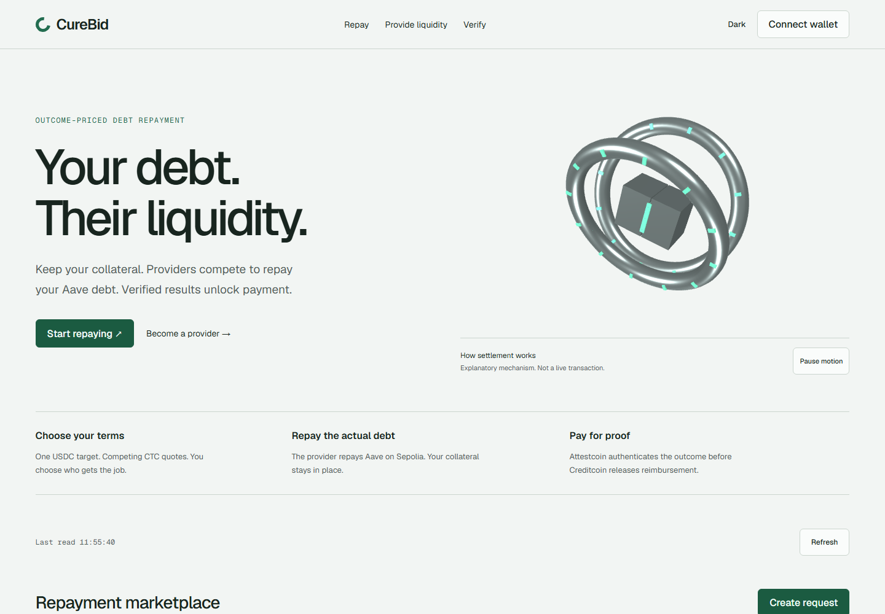

# CureBid: cross-chain debt repayment

CureBid lets liquidity providers compete to repay a borrower's Aave USDC debt on Ethereum Sepolia. The borrower funds escrow on Creditcoin, selects a fixed CTC quote, and keeps their collateral in Aave. The selected provider earns reimbursement only after Attestcoin authenticates the repayment outcome.

**Status:** submitted hackathon project with a live public-testnet application. Not audited or intended for production funds.

[Live application](https://curebid.vercel.app) · [Architecture and decisions](docs/engineering.md) · [Public execution](docs/evidence/execution-notes.md) · [Recorded walkthrough](docs/submission/curebid-walkthrough.mp4)



The preview shows the hosted UI. The 3D mechanism explains settlement; it does not represent a transaction being signed or executed.

## What runs today

- A deployed Sepolia router repays Aave and checks the returned amount against the borrower's debt reduction.
- A Creditcoin market collects provider quotes, reserves native testnet CTC, and tracks withdrawals separately from settlement.
- An immutable Attestcoin adapter verifies the source receipt and binds its outcome to the selected request. An authenticated expiry refunds the borrower; a delayed proof alone does not.
- A wallet-connected web application exposes requests, quotes, repayment, proof submission, withdrawals, and public verification.

Request 1 repaid **3 test USDC**, settled a **0.07 test CTC** reimbursement, and paid the provider. Request 2 completed the expiry/refund path. Recorded withdrawals cleared the canonical escrow's reserved funds, credits, and balance. The [execution record](docs/evidence/live-execution.json) and [transaction notes](docs/evidence/execution-notes.md) distinguish these owned testnet transactions from fork tests and third-party feasibility evidence.

## Stack and repository

| Layer                   | Technology                                                  | Source                                                                                                             |
| ----------------------- | ----------------------------------------------------------- | ------------------------------------------------------------------------------------------------------------------ |
| Contracts               | Solidity 0.8.30, OpenZeppelin, Foundry                      | [`contracts/`](contracts/)                                                                                         |
| Debt repayment          | Aave V3 on Ethereum Sepolia                                 | [`CureRouter.sol`](contracts/src/CureRouter.sol)                                                                   |
| Proof and settlement    | Creditcoin CC3 Testnet, Attestcoin native verifier, USC SDK | [`AttestcoinVerifier.sol`](contracts/src/AttestcoinVerifier.sol), [`CureMarket.sol`](contracts/src/CureMarket.sol) |
| Web application         | Next.js 16, React 19, TypeScript, ethers, Three.js          | [`apps/web/`](apps/web/)                                                                                           |
| Shared types and policy | TypeScript, ethers                                          | [`packages/protocol/`](packages/protocol/)                                                                         |
| Verification            | Foundry unit/fuzz/fork tests, Vitest, Playwright, axe       | [`contracts/test/`](contracts/test/), [`tests/browser/`](tests/browser/)                                           |

Contracts are the source of truth. There is no application database, privileged settlement worker, or server-held wallet. The Next.js proof endpoint transports proof data; the on-chain verifier decides whether it is valid.

## Run locally

Run these commands inside **WSL Ubuntu or Linux**, not Windows Git Bash or PowerShell. Keep Linux and Windows dependency installations separate. The bootstrap script installs the pinned Node and Foundry toolchains under the Linux user's home directory.

```sh
git clone https://github.com/SourceSenseiTheRealOne/hackathon-projects-creditcoin-cross-chain-debt-repayment.git
cd hackathon-projects-creditcoin-cross-chain-debt-repayment
bash scripts/bootstrap-toolchain.sh
bash scripts/wsl-run.sh pnpm install --frozen-lockfile
bash scripts/wsl-run.sh pnpm build
bash scripts/wsl-run.sh pnpm start
```

Open http://localhost:4310. The public routes are `/`, `/repay`, `/providers`, `/requests/[id]`, and `/verify`; `/requests/new` redirects to `/repay`. Reading the existing demo needs no wallet or private key. Signing actions require an injected wallet on the appropriate testnet.

## Test and verify

```sh
bash scripts/wsl-run.sh pnpm test
SEPOLIA_FORK_RPC=https://sepolia.gateway.tenderly.co bash scripts/wsl-run.sh forge test
bash scripts/wsl-run.sh pnpm typecheck
bash scripts/wsl-run.sh pnpm lint
bash scripts/wsl-run.sh pnpm judge:verify

# Keep the production server above running in another terminal.
bash scripts/wsl-run.sh pnpm exec playwright install --with-deps chromium
bash scripts/wsl-run.sh pnpm test:browser
```

`judge:verify` reads the deployed code, immutable configuration, solvency, and request states without loading a signer. It does not execute a new repayment or prove every historical transaction again. Foundry fork tests require an archive-capable Sepolia RPC; `SEPOLIA_FORK_RPC` selects the endpoint without changing the pinned blocks. Synthetic cryptographic outcomes are confined to contract test fixtures.

[Engineering notes](docs/engineering.md) explain the state machine, repayment rounding regression, proof binding, escrow accounting, recovery rules, and test boundaries. See the [testnet runbook](docs/testnet-runbook.md) before attempting any new transaction.

## Limits

This prototype supports Aave variable USDC debt on Sepolia and native CTC settlement on Creditcoin CC3 Testnet. It assumes the same borrower address on both chains, and likewise the same selected provider address. It is not a bridge or lending pool. CTC quotes are total reimbursements, not USD fees.

Attestation outages can leave assigned escrow locked. Providers bear liquidity, gas, exchange-rate, and proof-delay risk. There is no production audit, guaranteed liquidation protection, or claim of production-scale operation. Never send real funds or paste private keys into the browser.

[Security model](docs/integration-security.md) · [Delivery status](docs/delivery-status.md) · [Provenance](docs/provenance.md) · [Deck](docs/submission/curebid-deck.pdf)
